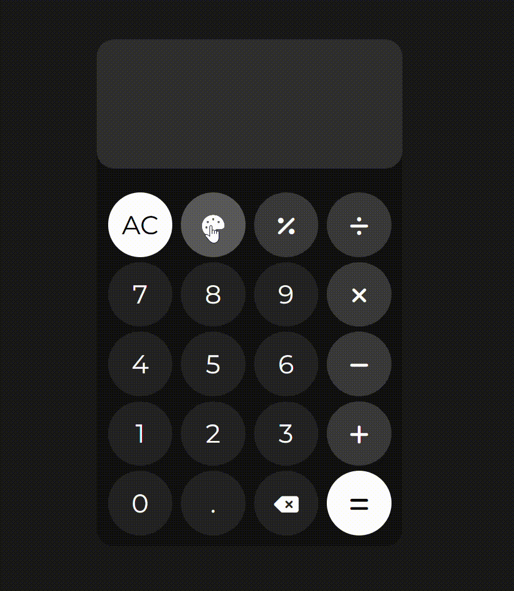
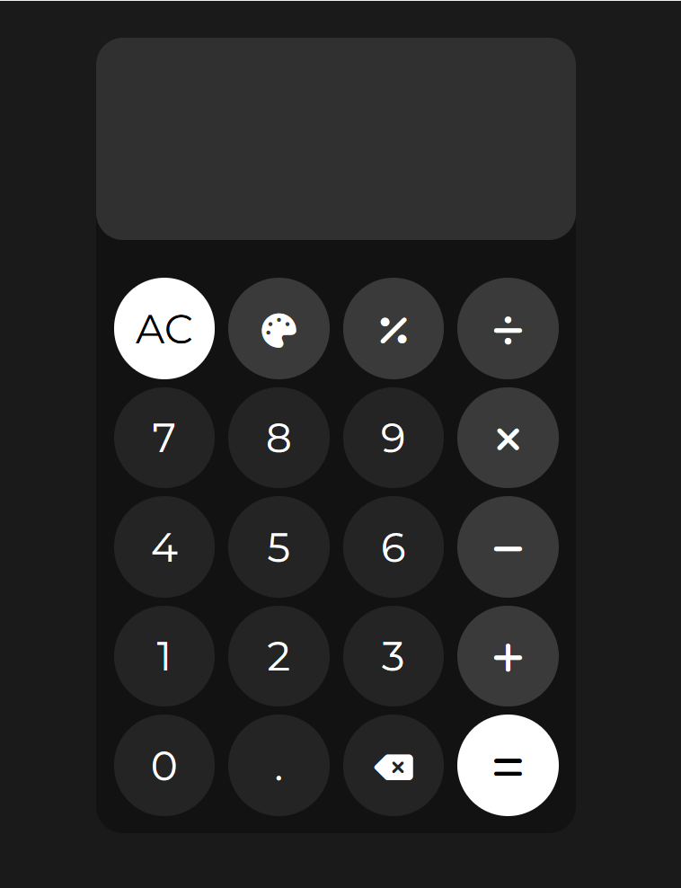

# Calculator

## About This Project

This is the final project from the **Foundations** section of **The Odin Project**. It’s a fully functional calculator that handles arithmetic operations, supports keyboard-like input behavior, and features a dynamic theme changer with smooth transitions.

---

## Live Preview

[View Live Demo](https://piyushb-27.github.io/calculator/)

## Demo & Screenshots

**Theme Changer in Action**  

**Default Theme**  

---

## 🔑 Features

- Fully functional calculator: addition, subtraction, multiplication, division, and modulus.
- Smooth and interactive UI with real-time display updates.
- Intelligent decimal and operator handling.
- Clear (`AC`) and backspace (`←`) functionality.
- **10 dynamic color themes** — switchable via a single button.

---

## 📚 Concepts Learned

- Semantic HTML layout and responsive design with Flexbox.
- Modular and clean JavaScript: functions, control flow, and state management.
- DOM manipulation and event handling.
- CSS variables and theme architecture.
- Input parsing, string building, and error handling.

---

## 🚧 Built With

- HTML5  
- CSS3 (custom properties, transitions)  
- JavaScript (ES6+)

---

## 🧱 Part of

**The Odin Project – Foundations Curriculum**  
[https://www.theodinproject.com](https://www.theodinproject.com)
